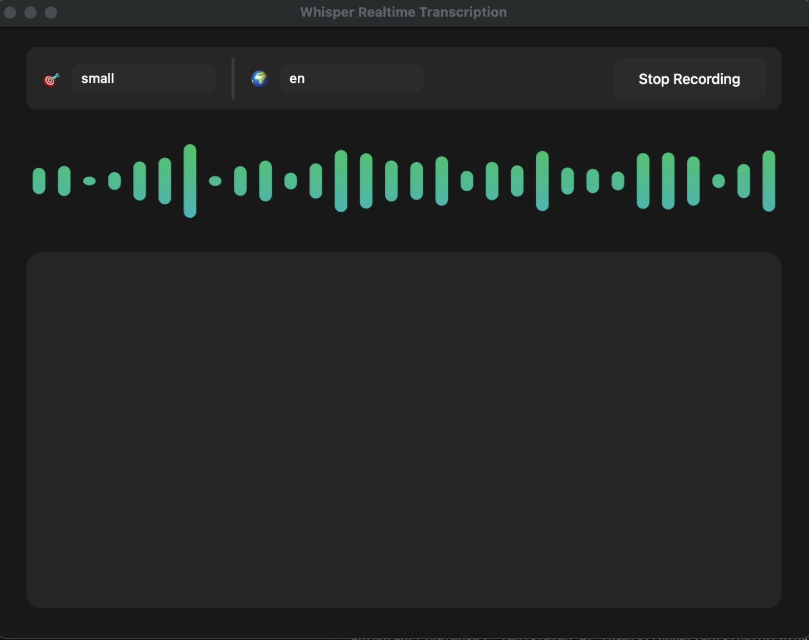

# Whisper Realtime Transcription GUI

A modern, real-time speech recognition application built with OpenAI's Whisper and PySide6. This application provides a beautiful, native-looking interface for transcribing audio in real-time with support for multiple languages.



## Features

- 🎙 Real-time audio transcription using OpenAI's Whisper
- 🌈 Beautiful, modern UI with animated audio visualizer
- 🚀 GPU acceleration support (Apple Silicon/CUDA)
- 🌍 Multi-language support (English, French, Vietnamese, and auto-detection)
- 📊 Live audio waveform visualization
- 💫 Smooth animations and transitions
- 🎯 Multiple Whisper model options (tiny, base, small, medium, large)
- 📝 File transcription support (audio/video to text)

## Components

### 1. Real-time Transcription (`whisper_gui.py`)
- Modern GUI application for real-time speech recognition
- Live audio visualization with beautiful animations
- Support for multiple languages and models
- GPU acceleration for better performance

### 2. File Transcription (`file-to-text.py`)
- Convert audio/video files to text
- Supports multiple file formats:
  - Audio: mp3, wav, m4a, etc.
  - Video: mp4, mkv, avi, etc.
- Batch processing capability
- Output formats:
  - Plain text (.txt)
  - Microsoft Word (.docx)
  - Timestamps support

## Requirements

- Python 3.11+
- macOS (tested on Apple Silicon)
- GPU recommended for better performance

## Installation

1. Clone the repository:
```bash
git clone https://github.com/phongthanhbuiit/whisper-realtime-gui.git
cd whisper-realtime-gui
```

2. Create and activate a virtual environment:
```bash
python -m venv venv
source venv/bin/activate  # On macOS/Linux
```

3. Install the required packages:
```bash
pip install -r requirements.txt
```

## Usage

### Real-time Transcription

1. Activate the virtual environment if not already activated:
```bash
source venv/bin/activate  # On macOS/Linux
```

2. Run the GUI application:
```bash
python whisper_gui.py
```

3. Select your preferred model and language from the dropdown menus
4. Click "Start Recording" to begin transcription
5. Speak into your microphone
6. The transcription will appear in real-time with timestamps

### File Transcription

1. To transcribe audio/video files:
```bash
python file-to-text.py --input path/to/your/file.mp4 --output output.txt
```

Options:
- `--input`: Input audio/video file path
- `--output`: Output file path (supports .txt and .docx)
- `--model`: Whisper model to use (default: small)
- `--language`: Language code (default: auto)
- `--timestamps`: Include timestamps in output (default: True)

## Configuration

### Model Selection
Choose from different Whisper models based on your needs:
- `tiny`: Fastest, lowest accuracy
- `base`: Good balance of speed and accuracy
- `small`: Better accuracy, still reasonable speed
- `medium`: High accuracy, slower
- `large`: Highest accuracy, slowest

### Language Support
- English (en)
- French (fr)
- Vietnamese (vi)
- Auto-detect (auto)

## Performance Tips

1. Use GPU acceleration when available:
   - The app automatically detects and uses Apple Silicon GPU (MPS) or CUDA
   - Falls back to CPU if GPU is not available

2. Choose the appropriate model:
   - For real-time transcription, `tiny` or `base` models are recommended
   - For file transcription, `small` or `medium` models provide better accuracy
   - For batch processing, consider available system resources

3. Buffer size optimization:
   - Real-time mode: 3-second buffer for optimal latency
   - File mode: Automatically optimized based on file size

## Contributing

Contributions are welcome! Please feel free to submit a Pull Request.

## License

This project is licensed under the MIT License - see the [LICENSE](LICENSE) file for details.

## Acknowledgments

- [OpenAI Whisper](https://github.com/openai/whisper) for the amazing speech recognition model
- [PySide6](https://wiki.qt.io/Qt_for_Python) for the modern GUI framework
- [sounddevice](https://python-sounddevice.readthedocs.io/) for real-time audio processing

## Author

- Thompson Bui (@phongthanhbuiit)
- Blog: [LinkedIn](https://www.linkedin.com/in/phong-thanh-b%C3%B9i-1867b628a/)
- Twitter: [@_windsora_](https://twitter.com/_windsora_)

## Support

If you found this project helpful, please give it a ⭐️!
